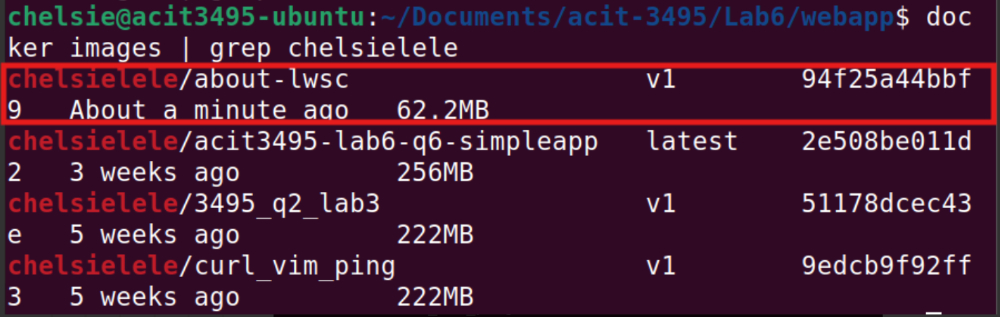
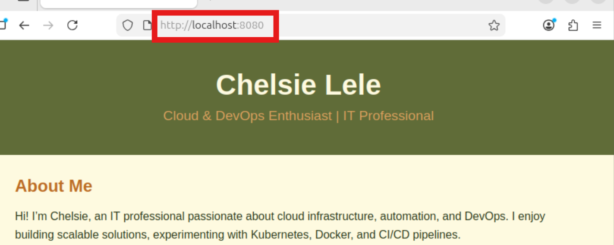
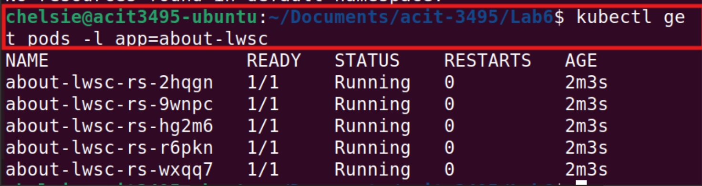
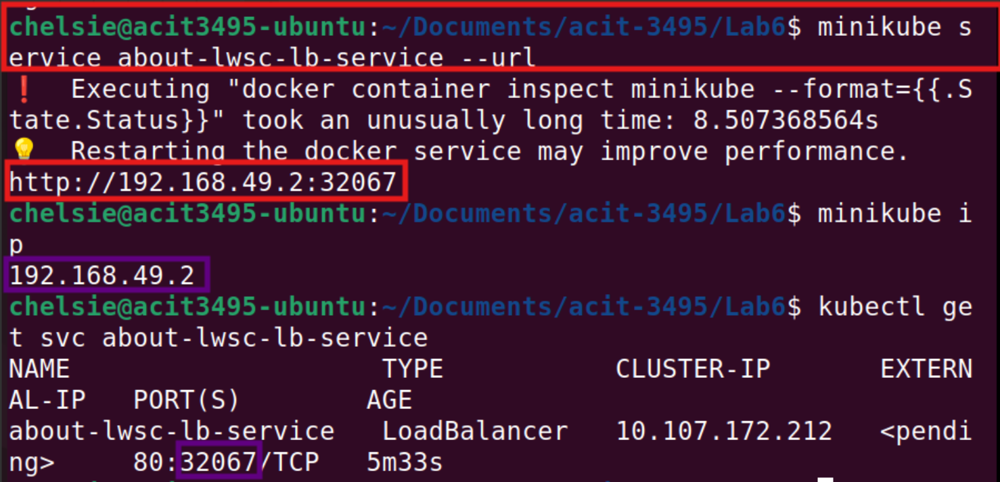
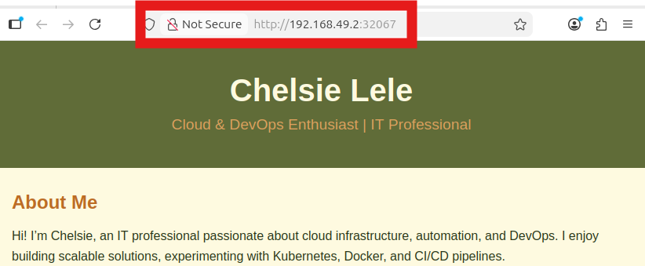

# Kubernetes Minikube Lab 

The project demonstrates how a simple web application moves through the following stages:

Application → Container → Image Registry → Kubernetes Pods → Service → Browser Access

---

# Technologies

* Kubernetes
* kubectl
* Docker
* DockerHub
* Minikube
* YAML manifests

---

# Deployment Workflow

This lab demonstrates the lifecycle of deploying a containerized application to Kubernetes.

1. Create a simple static web application
2. Containerize the application using Docker
3. Push the container image to Docker Hub
4. Deploy the image into Kubernetes pods
5. Maintain pod availability using a ReplicaSet
6. Expose the pods using a Kubernetes Service
7. Access the application through a browser using the service endpoint

---
# Repository Structure 
```
Kubernetes-labs/
│
├── pods/
│ └── pod.yml
│
├── replicasets/
│ ├── rs1.yml
│ └── webapp-rs.yml
│
├── services/
│ ├── svc-lb.yml
│ ├── svc-nodeport.yml
│ └── webapp-service.yml
│
├── webapp/
│ ├── Dockerfile
│ └── index.html
│
├── screenshots/
│ ├── accessing-W-url.png
│ ├── ensuring-5-pods-running.png
│ ├── images-check.png
│ ├── retrieving-url.png
│ └── testing-locally.png
│
└── README.md
```

---
# Architecture Overview

```
Browser
   │
NodePort Service
   │
ReplicaSet
   │
Pods
   │
Docker Container
   │
Docker Image (Docker Hub)
   │
Dockerfile
   │
index.html
```

---

# Application

Created a simple static webpage to simulate a web application.

Files:

```
webapp/index.html
```

```
webapp/Dockerfile
```

---

# Containerization & Pushing to DockerHub

The application was containerized using Docker.

Built the image:

```
docker build -t chelsielele/about-lwsc:v1 .
```

```
docker images | grep chelsielele

```
---

---

```
docker push chelsielele/about-lwsc:v1
```
I pushed the image to Docker Hub:

```
docker push chelsielele/about-lwsc:v1

```
Tested Locally (from within the VM)
```
docker run -d -p 8080:80 chelsielele/about-lwsc:v1
```
---

---
---

# Kubernetes Deployment & ReplicaSet Creation

I deployed the container image declaratively using a ReplicaSet.

File:

```
replicasets/webapp-rs.yml
```

Applied the configuration:

```
kubectl apply -f replicasets/webapp-rs.yml
```

Checked the status:

```
kubectl get pods -l app=about-lwsc
```
---

---

The ReplicaSet ensures that 5 pods are always running and serving the application.

---

# Service Exposure

The application pods are exposed using a Kubernetes Service. It exposes the application using a **NodePort**to allow external access

File:

```
services/webapp-service.yml
```

Created the service:

```
kubectl apply -f services/webapp-service.yml
```

---

# Accessing the Application

Retrieved the url to access the app:

```
minikube service about-lwsc-lb-service --url 
```
---

---
The application can then be accessed using:

```
http://192.168.49.2:32067
```
---

---


# Key Takeaways

* Built and containerized a web application using Docker
* Managed container images through Docker Hub
* Deployed workloads using Kubernetes ReplicaSets
* Exposed applications using Kubernetes Services
* Interacted with the cluster using `kubectl`
